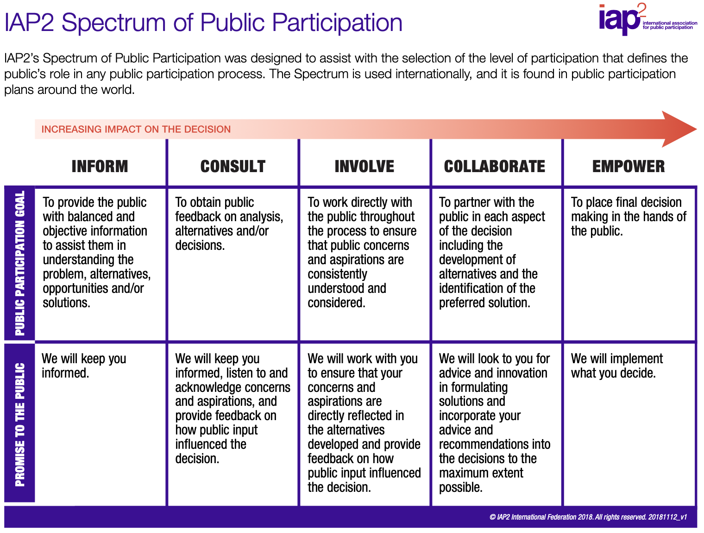
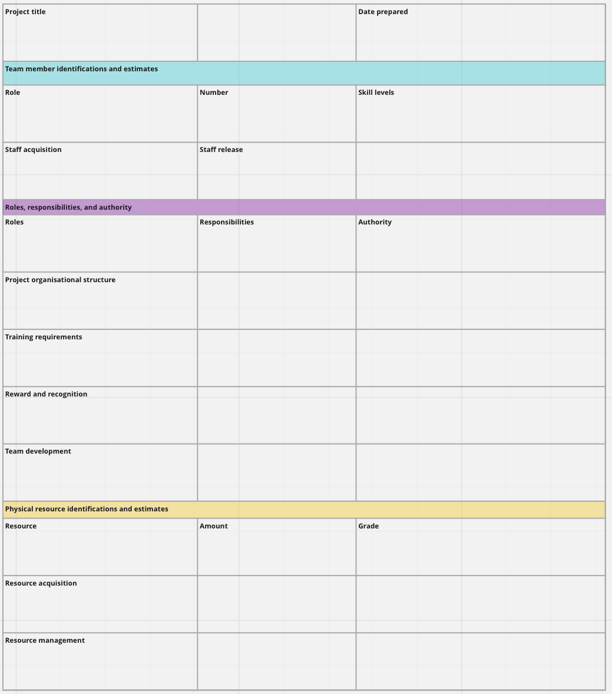

# WEEK 2 Stakeholder Management
## How to identify and analyse stakeholders? 如何识别和分析利益相关者？  

+ **What is meant by a Stakeholder?**  

Stakeholders are individuals, groups, or organizations who may affect, be affected by, or perceive themselves to be affected by a decision, activity or outcome of a project. Stakeholders can be internal or external.  

利益相关者是什么意思？ 利益相关者是可能影响、受其影响或认为自己受项目决策、活动或结果影响的个人、团体或组织。利益相关者可以是内部的或外部的。

  

+ **Why do we need to identify project stakeholders?**  

Stakeholders can influence and disrupt the progress of the project, or even threaten the likely success of the project. Stakeholders are not necessarily the project influencers - they can be people who are socially, economically and environmentally affected by the project. When these impacts are negative, the project manager has to exercise sound ethics and good corporate citizenship values to ensure the project does no harm to the people it affects, both inside and outside the organisation.  

为什么我们需要识别项目利益相关者？ 利益相关者可以影响和扰乱项目的进展，甚至威胁项目可能的成功。利益相关者不一定是项目的影响者——他们可以是在社会、经济和环境方面受项目影响的人。当这些影响是负面的时，项目经理必须行使良好的道德和良好的企业公民价值观，以确保项目不会对组织内外的受其影响的人造成伤害。  

  

 Once you list your project's stakeholders, you make the effort to meet with them and gather intelligence (ie information) about their personas, interest in, influence, and impact on your project, their communication styles, and other preferences, their knowledge, and skills, etc.

Using this people related intelligence or information, we will apply several  stakeholder analysis methods, notably the Myers-Briggs Type Indicator (MBTI) profiling and stakeholder profiles charting methods to contextualise the collected data for helping us identify the right engagement, communication and human resource strategies for managing them.  

一旦您列出项目的利益相关者，您就努力与他们会面并收集有关他们的角色、对您的项目的兴趣、影响和影响、他们的沟通方式和其他偏好、他们的知识和技能的情报（即信息） ， ETC。

使用这些与人相关的情报或信息，我们将应用几种利益相关者分析方法，尤其是迈尔斯-布里格斯类型指标 (MBTI) 分析和利益相关者概况图表方法，将收集的数据置于上下文中，以帮助我们确定正确的参与、沟通和人力资源战略用于管理它们。  

  

## 2) How to plan a stakeholder engagement form? 2) 如何规划利益相关者参与表？  

 dentify the people (organisations, community groups and individuals) that could impact or be impacted by the project;  

analyse these identified peoples' expectations, interests and influences on the project;  

engage with stakeholders, which involves developing and executing the appropriate management strategies for effectively engagement of stakeholders in project decision making and other execution work, in order to sustain their interest and support for the project.  

识别可能影响或受项目影响的人员（组织、社区团体和个人）； 分析这些确定的人的期望、兴趣和对项目的影响； 与利益相关者合作，这涉及制定和执行适当的管理策略，以使利益相关者有效地参与项目决策和其他执行工作，以维持他们对项目的兴趣和支持  
	

  

 The instructions for IDENTIFY Stakeholders, in compliance with PMBoK guidelines, helped you to identify the behavioural risks of identified stakeholders and how you can appropriately group them by their behavioural risk exposures on your project.  

This step is to mitigate these behavioural risks by choosing the right engagement risk response strategies. “Stakeholder engagement is the systematic identification, analysis, planning, and implementation of actions designed to influence stakeholders.  

识别利益相关者的说明符合 PMBoK 指南，帮助您识别已识别利益相关者的行为风险，以及如何根据他们在项目中的行为风险暴露对他们进行适当的分组。此步骤是通过选择正确的参与风险应对策略来减轻这些行为风险。“利益相关者参与是系统地识别、分析、规划和实施旨在影响利益相关者的行动。”  
	

  
  

## 3) What is stakeholder engagement?  

the process of interacting with stakeholders and influencing them to secure and sustain their interest in, support of and involvement in the project, in order to protect project success.

While stakeholder management is the process of managing stakeholders’ behaviours to ensure project success, engagement is about influencing stakeholders through consultation, communication, negotiation, compromise, and relationship building as we can see through the diagram below  

什么是利益相关者参与？ 是与利益相关者互动并影响他们以确保和维持他们对项目的兴趣、支持和参与以保护项目成功的过程。 利益相关者管理是管理利益相关者行为以确保项目成功的过程，而参与则是通过协商、沟通、谈判、妥协和建立关系来影响利益相关者  

  

## 4) How does stakeholder management affect a project's success or failure?  

 Key stakeholders can provide requirements and constraints based on the information from their industry. This will help the project team to understand project risks and the more stakeholders get engaged and involved the more risks will be uncovered and reduced.  

关键利益相关者可以根据其行业的信息提供要求和约束。这将有助于项目团队了解项目风险，参与和参与的利益相关者越多，发现和减少的风险就越多。  

  

## 5) How to effectively communicate with stakeholders? 如何与利益相关者进行有效沟通？  

 we also need to manage their project expectations by the ways we can communicate effectively with them. This means understanding their communication styles, strengths, and weaknesses, including business language and literacy competency levels.  This understanding will help us decide what are the best ways (ie channels eg social media, meetings, email messaging, text messaging, etc) to communicate with them, how often and what information delivery formats (eg formal progress reports; project highlight tweets; visual presentations, press releases, etc) are suitable  

我们还需要通过与他们进行有效沟通的方式来管理他们的项目期望。这意味着了解他们的沟通方式、优势和劣势，包括商务语言和读写能力水平。这种理解将帮助我们决定与他们沟通的最佳方式（即社交媒体、会议、电子邮件消息、短信等）、信息传递的频率和格式（例如正式的进度报告；项目亮点推文；视觉演示，新闻稿等）是合适的  

  

+ Useful Communication Techniques  

When communicating written information to stakeholders, including your Assignment 2 Report, PMBoK recommends applying the 5Cs of Written Communications.  

有用的沟通技巧，在向利益相关者传达书面信息（包括您的作业 2 报告）时，PMBoK 建议应用书面沟通的 5C。  

+ Correct (Grammar and Spelling)

+ Concise Expression 简洁的表达  

+ Clear (purpose or intent) 明确（目的或意图）  

+ Coherent (logical flow of ideas)  连贯（思想的逻辑流动）

+ Controlling (flow of words and ideas) 控制（文字和想法的流动）

  

## 6)  How to plan a human resource management form? 如何规划人力资源管理表格？

Chapter 9 of the PMBoK sixth edition guide (2017) provides the procedural guidelines for you to plan your human (and other types of) resources  
	

  
  

## How would those two key stakeholders (Sponsors and end-users) interpret project success differently?  

Sponsor would consider a project successful as long as it gets completed within the budget and in time, whereas end-users would judge project success based on the ease of use of the final product.  

只要项目在预算内按时完成，发起人就会认为项目是成功的，而最终用户会根据最终产品的易用性来判断项目是否成功。

# WEEK 3  Enterprise Architecture and Software Design
