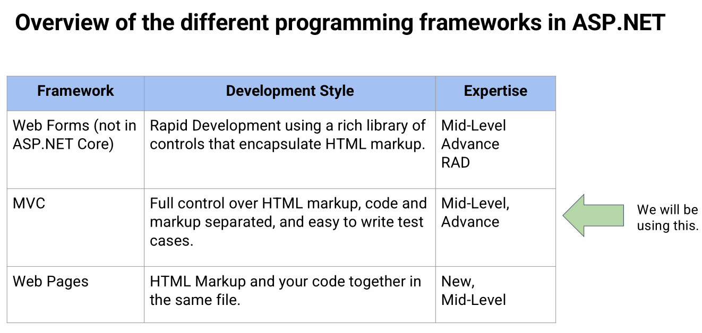

# Week 1 Intro to Web development and ASP.Net  
## Coding guide
https://github.com/mdo/code-guide 
## How the Web Works  
 Computers connected to the web are called clients and servers. The clients are usually the user’s internet connected devices and web accessing software on those devices.  
 The servers are computers that store web pages, sites or apps. When a client device wants to access a webpage, a copy of the webpage is downloaded from the server onto the client machine to be displayed on the users web browser.  
连接到网络的计算机称为客户端和服务器。客户端通常是用户的互联网连接设备和这些设备上的网络访问软件。服务器是存储网页、站点或应用程序的计算机。当客户端设备想要访问网页时，网页的副本会从服务器下载到客户端机器上以显示在用户的网络浏览器上。

 When you type a web address into your browser

 the browser goes to the DNS server, and finds the real address of the server that the website lives on  
The browser sends a HTTP request to message to the server, asking it to send a copy of  the website to the client. This message is sent across your internet connection using  TCP/IP  
The server approves of the clients request, and sends a 200 OK meaning that the client  can take a look at the website.The server then starts sending packets to the client  
The browser assembles these packets and complete them into a website and displays it to  you
浏览器转到 DNS 服务器，并找到网站所在服务器的真实地址。 2. 浏览器向服务器发送 HTTP 请求消息，要求它向客户端发送网站的副本。此消息使用 TCP/IP 通过您的 Internet 连接发送。 3. 服务器同意客户端请求，发送200 OK 表示客户端可以浏览网站。然后服务器开始向客户端发送数据包。 4. 浏览器将这些数据包组装成一个网站并显示给你。

## What is MVC  
The Model-View-Controller (MVC) architectural pattern separates an application into three main groups of components: Models, Views, and Controllers.
his architectural pattern helps to achieve separation of concerns.  
模型-视图-控制器 (MVC) 架构模式将应用程序分为三个主要组件组：模型、视图和控制器。 • 这种架构模式有助于实现关注点分离。  
	  
	   

## Model  
 A class or set of classes that describes all the business logic and additionally handles data access for an application.  
 Also contains code that defines its relationship with othermodels.  
Defines the data validation rules to be used when adding or updating data  
描述所有业务逻辑并额外处理应用程序数据访问的类或一组类。 • 还包含定义其与其他模型关系的代码。 • 定义添加或更新数据时要使用的数据验证规则  

### Model Responsibilities  
The Model in an MVC application represents the state of the application and any business logic or operations that should be performed by it  
Business logic should be encapsulated in the model, along with any implementation logic for persisting the state of the application  
Strongly-typed views typically use ViewModel types designed to contain the data to display on that view  
he controller creates and populates these ViewModel instances from the model  
MVC 应用程序中的模型表示应用程序的状态以及应由它执行的任何业务逻辑或操作。 ● 业务逻辑应封装在模型中，以及用于持久化应用程序状态的任何实现逻辑。 ● 强类型视图通常使用旨在包含要在该视图上显示的数据的 ViewModel 类型。 ● 控制器从模型中创建并填充这些 ViewModel 实例  

### Domain Model  
 Domain Modeling is a way to describe and model real world entities and the relationships between them, which collectively describe the problem domain space.  
The domain model will often include abstractions and services that allow the Controller to operate at a higher level of abstraction  
The domain model will usually include interface definitions (for services, repositories, etc.) used by the app, as well as persistence-ignorant entities (and some services) that represent the state and behavior of the app’s business logic  
It is quite common practice to wrap a service layer over the domain model.  
  域建模是一种描述和建模现实世界实体及其之间关系的方法，它们共同描述了问题域空间。 ● 领域模型通常包括允许控制器在更高抽象级别上运行的抽象和服务。 ● 领域模型通常包括应用程序使用的接口定义（用于服务、存储库等），以及表示应用程序业务逻辑的状态和行为的持久性无知的实体（和一些服务）。 ● 在域模型上包装服务层是很常见的做法。 

### View Model  
 In an MVC web application, a ViewModel is a type that includes just the data a View requires for display (and perhaps sending back to the server  
ViewModel types can also simplify model binding in ASP.NET MVC.
 ViewModel types are generally just data containers; any logic they may have should be
specific to helping the View render data.  
 There may be many similar ViewModel types, each tailored to the needs of a particular View.
ViewModel 类型还可以简化 ASP.NET MVC 中的模型绑定。 ● ViewModel 类型一般只是数据容器；他们可能拥有的任何逻辑都应该特定于帮助 View 呈现数据。 ● 可能有许多相似的 ViewModel 类型，每种类型都针对特定 View 的需求量身定制  

### API Model  
 if your application exposes an API, the format of the data you expose to clients may be  separated from your app’s internal domain model by defining custom API model types.
This allows you to change your internal model types without impacting clients that may be using your exposed APIs.
 Typically these exposed API models will be used by clients both for read and write operations, so these types will act as both ViewModel and BindingModel for APIs.
 The API Model is a very important concept for modern web development. This will be shown to you later in the semester.
The API Model will make use of the Web API feature of ASP.NET  
  如果您的应用程序公开了一个 API，那么您向客户端公开的数据格式可以通过定义自定义 API 模型类型与您的应用程序的内部域模型分离。 ● 这允许您更改内部模型类型，而不会影响可能正在使用您公开的 API 的客户端。 ● 通常，这些公开的 API 模型将被客户端用于读取和写入操作，因此这些类型将充当 API 的 ViewModel 和 BindingModel。 ● API 模型是现代Web 开发的一个非常重要的概念。这将在本学期晚些时候向您展示。 ● API 模型将利用 ASP.NET 34 的 Web API 特性


## Controller  
1. Controls the application flow or logic of the application  
2. Controller logic decides what response is to be generated  
3. Controller logic normally contains calls to models to access data, and also other functionalities like access control checks etc  
4. Controller passes the response (output) to the view  
控制应用程序流程或应用程序逻辑 控制器逻辑决定要生成什么响应 控制器逻辑通常包含对模型的调用以访问数据，以及访问控制检查等其他功能 控制器将响应（输出）传递给视图  

### Controller Responsibilities  
Controllers are the components that handle user interaction, work with the model, and ultimately select a view to render 
In an MVC application, the view only displays information; the controller handles and responds to user input and interaction  
 In the MVC pattern, the controller is the initial entry point, and is responsible for selecting which model types to work with and which view to render (hence its name - it controls how the app responds to a given request)  
Controllers shouldn't be overly complicated by too many responsibilities  
To keep controller logic from becoming overly complex, use the Single Responsibility Principle to push business logic out of the controller and into the domain model.  
  控制器是处理用户交互、使用模型并最终选择要呈现的视图的组件。 ● 在MVC 应用中，视图只显示信息；控制器处理并响应用户输入和交互。 ● 在 MVC 模式中，控制器是初始入口点，负责选择要使用的模型类型以及要呈现的视图（因此得名 - 它控制应用程序如何响应给定请求）。 ● 控制器不应该因为过多的职责而过于复杂。 ● 为了避免控制器逻辑变得过于复杂，使用单一职责原则将业务逻辑推出控制器并进入域模型。

## View  
View is the outputs or responses that are sent back to the user once a request is processed.
Consist of markup (like HTML) code with embedded .NET code. Can also be other forms of output like XML, PDF documents etc.
Views can be thought of as the presentation layer of anapplication and ideally should be as "dumb" as possible  
视图是处理请求后发送回用户的输出或响应。 • 由带有嵌入式.NET 代码的标记（如HTML）代码组成。也可以是其他形式的输出，如 XML、PDF 文档等。 • 视图可以被认为是应用程序的表示层，理想情况下应该尽可能“哑”   

The Views are normally just HTML files.
Most web applications have a common layout that provides the user a consistent experience as the user navigates from page to page. Layouts help to reduce the amount of duplicate codes in the view, helping in the Don’t Repeat Yourself (DRY) principle. In our project, this file can be found under the Shared directory, with the filename _Layout.cshtml. You can think of this as the concept of Master pages, meaning that for all pages there are things that are always there for example the header (navigation bar) and footer (contents at the end of the page). Thus, it would be pointless for this portion of the code to repeat itself multiple times.  
视图通常只是 HTML 文件。大多数 Web 应用程序都有一个通用布局，当用户从一个页面导航到另一个页面时，该布局为用户提供一致的体验。布局有助于减少视图中重复代码的数量，有助于实现不重复 (DRY) 原则。在我们的项目中，这个文件可以在 Shared 目录下找到，文件名为 _Layout.cshtml。您可以将其视为母版页的概念，这意味着对于所有页面，总会有一些东西，例如页眉（导航栏）和页脚（页面末尾的内容）。因此，这部分代码重复多次是没有意义的。
+ 


### View Responsibility  
Views are responsible for presenting content through the user interface  
They use the Razor view engine to embed .NET code in HTML markup.  
There should be minimal logic within views, and any logic in them should relate to presenting content  
If you find the need to perform a great deal of logic in view files in order to display data from a complex model, consider using a View Component, ViewModel, or view template to simplify the view  
视图负责通过用户界面呈现内容。 ● 他们使用 Razor 视图引擎在 HTML 标记中嵌入 .NET 代码。 ● 视图中应该有最少的逻辑，其中的任何逻辑都应该与呈现内容相关。 ● 如果您发现需要在视图文件中执行大量逻辑以显示来自复杂模型的数据，请考虑使用视图组件、视图模型或视图模板来简化视图  

### Views in ASP.NET MVC  
 In the Model-View-Controller (MVC) pattern, the view handles the app's data presentation and user interaction  
A view is an HTML template with embedded Razor markup
Razor markup is code that interacts with HTML markup to produce a webpage that's sent to the client  
In ASP.NET MVC, views are .cshtml files that use the C# programming language in Razor markup  
Usually, view files are grouped into folders named for each of the app's controllers  
  在模型-视图-控制器 (MVC) 模式中，视图处理应用程序的数据呈现和用户交互。 ● 视图是带有嵌入式 Razor 标记的 HTML 模板。 ● Razor 标记是与HTML 标记交互以生成发送到客户端的网页的代码。 ● 在 ASP.NET MVC 中，视图是在 Razor 标记中使用 C# 编程语言的 .cshtml 文件。 ● 通常，视图文件被分组到为每个应用程序控制器命名的文件夹中。 

### What is Razor  
 Razor is a markup syntax for embedding server-based code into web pages. The Razor syntax consists of Razor markup, C#, and HTML. Files containing Razor generally have a .cshtml file extension  
The default Razor language is HTML. Rendering HTML from Razor markup is no different than rendering HTML from an HTML file. HTML markup in .cshtml Razor files is rendered by the server unchanged  
  Razor 是一种将基于服务器的代码嵌入网页的标记语法。 Razor 语法由 Razor 标记、C# 和 HTML 组成。包含 Razor 的文件通常具有 .cshtml 文件扩展名。 ● 默认的 Razor 语言是 HTML。从 Razor 标记呈现 HTML 与从 HTML 文件呈现 HTML 没有什么不同。 .cshtml Razor 文件中的 HTML 标记由服务器原样呈现。  


## ASP.NET Overview  
ASP.NET is part of the .NET platform offers different programming frameworks for creating web applications  
Web Forms (Not in ASP.NET Core)  
MVC  
Web Pages  
Each of these frameworks targets a different development style.  
	  

## Anatomy of an HTML element  
### fundamental
```
HTML – Hypertext Markup Language  

<p>Welcome to FIT5032.</p>
```

1. The opening tag: This consist of the name of the element (in this example, it is a p)  wrapped in opening angle brackets. This states where the element begins, or starts  of take effect. P stands for paragraph  
2. The closing tag: This is the same as the opening tag, except that it includes a  forward slash before the element name. This states where the element ends.  Failing to include a closing tag is one of the common beginner errors and can lead  to strange results  
3. The content: This is the content of the element. In this case, the content is  Welcome to FIT5032  
4. The element: The opening tag, the closing tag and the content together comprise  the element  
	开始标签：这包括元素的名称（在本例中，它是一个 p），包裹在开始的尖括号中。这说明元素开始的位置，或开始生效的位置。 P代表段落。 2. 结束标签：这与开始标签相同，只是它在元素名称前包含一个正斜杠。这说明了元素的结束位置。未包含结束标签是常见的初学者错误之一，可能会导致奇怪的结果。 3. 内容：这是元素的内容。在这种情况下，内容是 Welcome to FIT5032 4. 元素：开始标签、结束标签和内容共同构成元素  

### Attributes
```
<p class="example">Welcome to FIT5032.</p>
```
Elements can also have one or more attribute.  Attributes contain extra information about the element you do not want to  appear in the actual content. Here, class is the attribute name and example is  the attribute value.  An attribute should always have  

 A space between it and the element name (or the previous attribute, if  the element has one or more attributes)  
The attribute name followed by an equals sign.  
Opening and closing quote marks wrapped around the attribute value  
	元素也可以有一个或多个属性。属性包含有关您不希望出现在实际内容中的元素的额外信息。这里，class 是属性名，example 是属性值。一个属性应该总是有 1。它和元素名称之间有一个空格（或前一个属性，如果元素有一个或多个属性） 2。属性名称后跟一个等号。 3. 围绕属性值的开闭引号

### The anchor element  
`<a href="https://www.google.com" title="Google">Click me to go Google.</a>`
This element creates a hyperlink to other web pages, files, locations within  the same page, email address or any other URL.  
 href → Hypertext Reference. This contains a URL or URL fragment that  the hyperlink points to. So, the value of this attribute is the web address  you want go to when the link is clicked. Thus, upon clicked, you will  navigate to https://www.google.com It is important to specify the protocol  (http or https) so that you always get the expected results.    
 
 title → A global attribute, contains text representing advisory information,  related to the element it belongs to  
	此元素创建指向其他网页、文件、同一页面内的位置、电子邮件地址或任何其他 URL 的超链接。 ● href → 超文本参考。这包含超链​​接指向的 URL 或 URL 片段。所以，这个属性的值就是当链接被点击时你想去的网址。因此，单击后，您将导航到 https://www.google.com 指定协议（http 或 https）很重要，这样您始终可以获得预期的结果。 ● 标题 → 全局属性，包含表示咨询信息的文本，与其所属的元素相关

### Double Quote
```
<a href="https://www.monash.edu/">Monash University Link</a>
```
all HTML attributes are wrapped using double quotes. However, if you are  using materials from online sources, you will sometimes see single quotes.  This is a matter of personal preference. But, for this subject, we prefer double quotes over  single quotes  
所有 HTML 属性都使用双引号括起来。但是，如果您使用来自在线资源的材料，您有时会看到单引号。这是个人喜好问题。但是，对于这个主题，我们更喜欢双引号而不是单引号

### Nesting elements  
```html
<p class="example">Welcome to <strong>FIT5032</strong>.</p>
```  
+ put elements inside other elements. This is called nesting. For  example, we could wrap the word FIT5032 in a `<strong>` element, which  means that the word is to be strongly emphasized.  
+ It is important to ensure your elements are properly nested. In the example  given, the `<p>` element comes first followed by the strong, there we must close  the `<strong>` before the close the `<p>` element. (The order is important)  It is important to open and close the elements correctly. This is to ensure the  web browser will behave as expected
	您可以将元素放在其他元素中。这称为嵌套。例如，我们可以将单词 FIT5032 包裹在 `<strong>` 元素中，这意味着要强烈强调该单词。确保您的元素正确嵌套很重要。在给出的示例中，`<p>` 元素首先出现，然后是 strong，我们必须在关闭 `<p>` 元素之前关闭 `<strong>`。 （顺序很重要）正确打开和关闭元素很重要。这是为了确保 Web 浏览器按预期运行  

### Image tag  
```html
  
```  
src attribute 
+ specify the path to our image file  

alt attribute    
+ specify descriptive text for users who cannot see the image which might  be due to visual impairment  
+ If something went that causes the image not to display, the descriptive text  will be shown instead.  
+ It is always a good idea for the alt value to provide enough information so  that the reader have a good idea what the image conveys